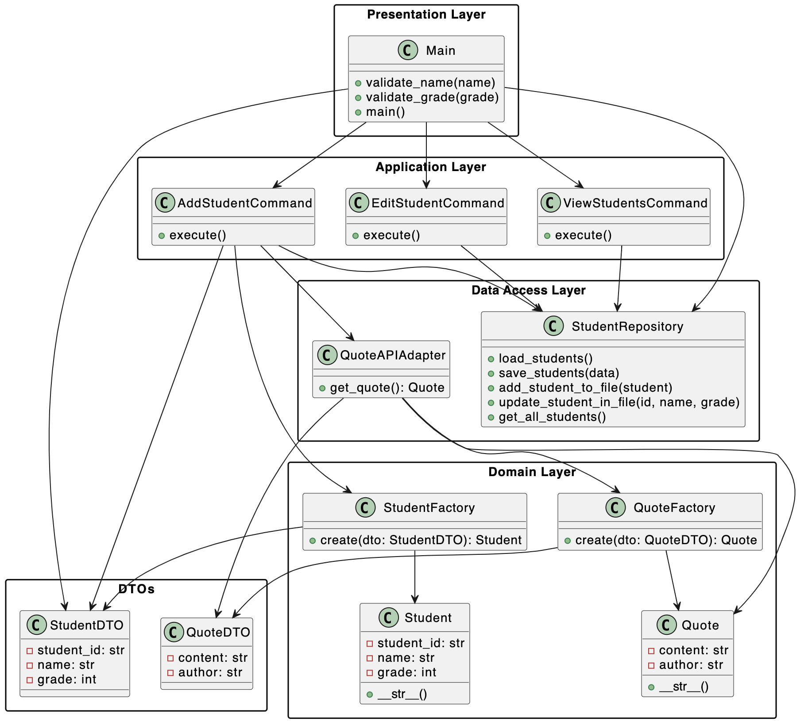

# Console-based-Student-Record-Management-System
Console-based Student Record Management System by Darya Stasiuk from group 353505
# UI description
```
-----------------------------------------------STUDENT MANAGEMENT SYSTEM-----------------------------------------------
1. Add Student
2. Edit Student
3. View Students
4. Exit
Choose option:
```
#  Functions
## Add Student
```
-----------------------------------------------STUDENT MANAGEMENT SYSTEM-----------------------------------------------
1. Add Student
2. Edit Student
3. View Students
4. Exit
Choose option: 1
Enter Name: Nastya
Enter Grade: 19
Student Added Successfully: ID: 2, Name: Nastya, Grade: 19
Motivational Quote: 
"By accepting yourself and being fully what you are, your presence can make others happy." — Jane Roberts
```
## Edit Student
```
-----------------------------------------------STUDENT MANAGEMENT SYSTEM-----------------------------------------------
1. Add Student
2. Edit Student
3. View Students
4. Exit
Choose option: 3
All Students:
ID: 1, Name: Ilya, Grade: 35
ID: 2, Name: Asya, Grade: 19
ID: 3, Name: Lola, Grade: 67
ID: 4, Name: Nastya, Grade: 19
ID: 5, Name: Olya, Grade: 80
ID: 6, Name: Ulalala, Grade: 25

-----------------------------------------------STUDENT MANAGEMENT SYSTEM-----------------------------------------------
1. Add Student
2. Edit Student
3. View Students
4. Exit
Choose option: 2
Enter ID to edit: 9
No student found with ID 9.

-----------------------------------------------STUDENT MANAGEMENT SYSTEM-----------------------------------------------
1. Add Student
2. Edit Student
3. View Students
4. Exit
Choose option: 2
Enter ID to edit: 5
New Name: OLYA
New Grade: 42
Student Updated Successfully!
```
## View Students
```
-----------------------------------------------STUDENT MANAGEMENT SYSTEM-----------------------------------------------
1. Add Student
2. Edit Student
3. View Students
4. Exit
Choose option: 3
All Students:
ID: 1, Name: Ilya, Grade: 35
ID: 2, Name: Asya, Grade: 19
ID: 3, Name: Lola, Grade: 67
ID: 4, Name: Nastya, Grade: 19
ID: 5, Name: OLYA, Grade: 42
ID: 6, Name: Ulalala, Grade: 25

```
# UML Diagramm
